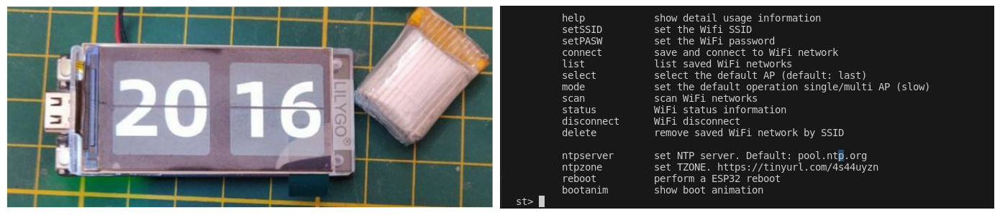
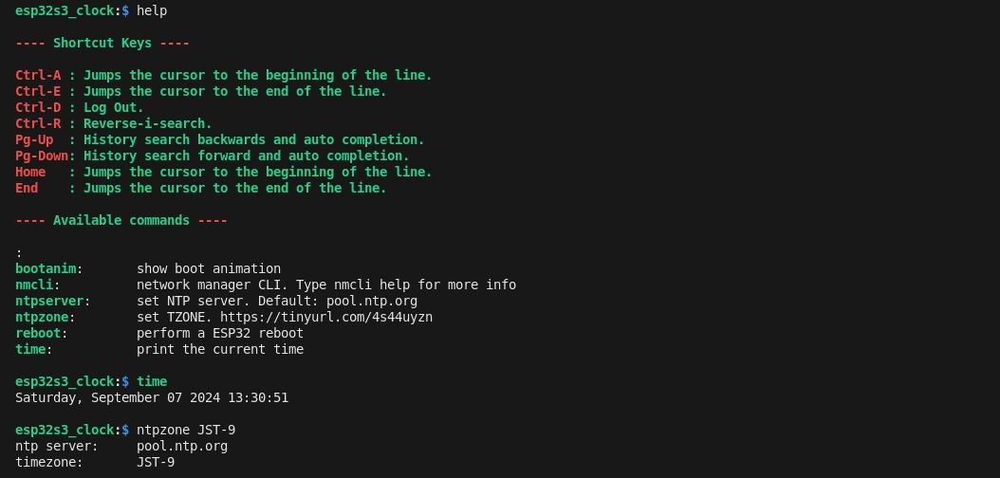

# esp32-s3-clock

Basic digital clock synced with Internet via NTP and configured via command line (CLI via USB-Serial)

## Build and Upload

Please install first [PlatformIO](http://platformio.org/) open source ecosystem for IoT development compatible with **Arduino** IDE and its command line tools (Windows, MacOs and Linux). Also, you may need to install [git](http://git-scm.com/) in your system. After install that you should have the command line tools of PlatformIO. Please test it with `pio --help`. Then please run the next command for build and upload the firmware:

```bash
pio run --target upload
```

## Configuration



Using your USB cable, connect it and run:

```bash
pio device monitor
```

Press enter and type help. You should see the configuration commands for setup your WiFi and time settings.

For instance to set Tokio time zone, select the correct time zone code [here](https://raw.githubusercontent.com/nayarsystems/posix_tz_db/master/zones.csv) and set it:

```bash
ntpzone JST-9
```

## CLI preview



## Credits

The original version was from [LilyGO](https://github.com/Xinyuan-LilyGO/T-Display-S3), but this version burned the libraries and dependencies into the main repository. Also the LVGL config was into the hidden directory. For show the best practices I did this basic example using some tools from PlatformIO to suppress this bad practices.  
